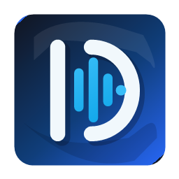

<p align="center">
  
</p>

# Dosty Speak

**Current version:** 0.3.63  
**Downloads:** [latest GitHub release](https://github.com/LukasDostalCZ/DostySpeak/releases/latest)  
**License:** MIT

Dosty Speak is a cross-platform phrase-based text-to-speech app for quickly speaking typed text and saved phrases. It is built with C++17 and Qt, with a separate Qt Quick mobile interface for Android and iOS experiments.

## Highlights

- Speak typed text immediately.
- Save and reuse common phrases.
- Use native system voices, Piper, eSpeak NG, Google online voice, or Microsoft Edge online voice where available.
- Build desktop packages for Windows, macOS and Linux.
- Build experimental mobile previews and Android APKs from the terminal builders.

## Platforms

| Platform | Status | Output |
|---|---|---|
| Windows 64-bit | Main supported Windows build | installer EXE, portable ZIP |
| Windows 32-bit | Legacy fallback | basic Win32 SAPI-only portable build |
| macOS | Desktop build | app bundle, ZIP/DMG release package |
| Linux | Desktop packages | DEB, RPM, portable package |
| Android | Experimental mobile app | debug-signed APK |
| iOS | Experimental project generation | Xcode project |

## Quick Start

Use the platform terminal builders for normal development and release builds.

### Windows

```powershell
powershell -NoProfile -ExecutionPolicy Bypass -File .\scripts\build-terminal-windows.ps1
```

Requirements and troubleshooting: [docs/WINDOWS_BUILD.md](docs/WINDOWS_BUILD.md)

### macOS

```bash
chmod +x scripts/build-terminal-macos.sh
./scripts/build-terminal-macos.sh
```

Terminal builder details: [docs/TERMINAL_BUILDERS.md](docs/TERMINAL_BUILDERS.md)

### Linux

```bash
chmod +x scripts/build-terminal-linux.sh
./scripts/build-terminal-linux.sh
```

Terminal builder details: [docs/TERMINAL_BUILDERS.md](docs/TERMINAL_BUILDERS.md)

### Mobile

Mobile code lives in `mobile/` and uses Qt Quick/QML.

```powershell
powershell -NoProfile -ExecutionPolicy Bypass -File .\scripts\build-android-apk-windows.ps1
```

Mobile build details: [docs/MOBILE.md](docs/MOBILE.md)

## Documentation

| Topic | Document |
|---|---|
| Terminal builders | [docs/TERMINAL_BUILDERS.md](docs/TERMINAL_BUILDERS.md) |
| Windows builds | [docs/WINDOWS_BUILD.md](docs/WINDOWS_BUILD.md) |
| Windows x86 legacy notes | [docs/WINDOWS_X86_NOTES.md](docs/WINDOWS_X86_NOTES.md) |
| Mobile, Android and iOS | [docs/MOBILE.md](docs/MOBILE.md) |
| Speech engines | [docs/SPEECH_ENGINES.md](docs/SPEECH_ENGINES.md) |
| Optional dependencies | [docs/DEPENDENCIES.md](docs/DEPENDENCIES.md) |
| Online voices | [docs/ONLINE_VOICES.md](docs/ONLINE_VOICES.md) |
| Edge TTS | [docs/EDGE_TTS.md](docs/EDGE_TTS.md) |
| Windows Piper on LTSC | [docs/WINDOWS_PIPER_LTSC.md](docs/WINDOWS_PIPER_LTSC.md) |
| MSYS2 keyring repair | [docs/MSYS2_KEYRING_REPAIR.md](docs/MSYS2_KEYRING_REPAIR.md) |

## Project Layout

```text
src/        Desktop Qt Widgets app
mobile/     Qt Quick mobile app and platform speech bridges
scripts/    Build, packaging and diagnostic helpers
resources/  Icons, translations and voice catalog data
packaging/  Platform packaging files
docs/       Detailed setup and troubleshooting guides
```

## Versioning

The app version is stored in [VERSION](VERSION). CMake, packaging scripts and build logs read from this file so release artifacts stay aligned.

## Changelog

See [CHANGELOG.md](CHANGELOG.md) for release history.

## Author

Created by **Lukáš Dostál** <luklin626@gmail.com>.
